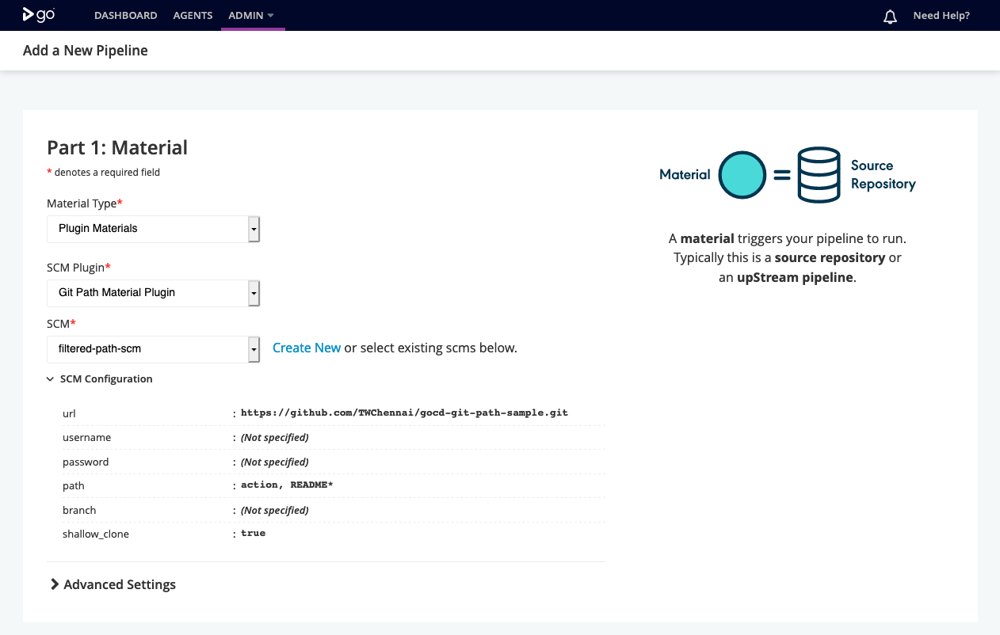
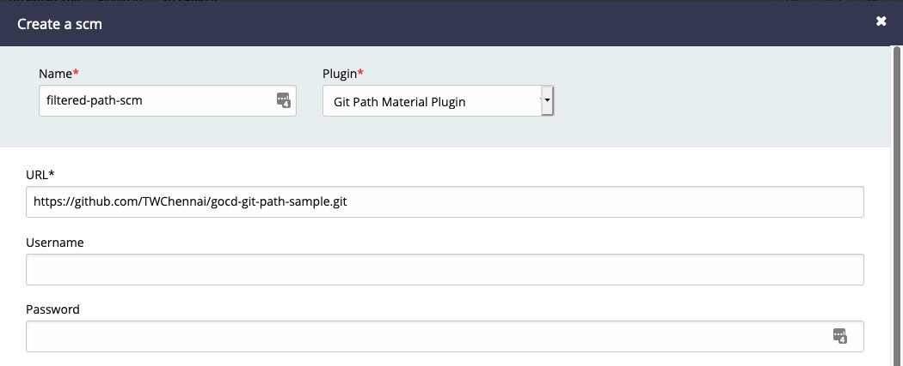
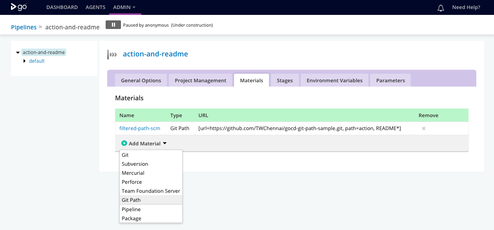
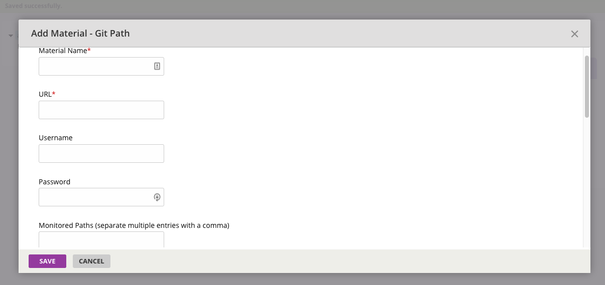
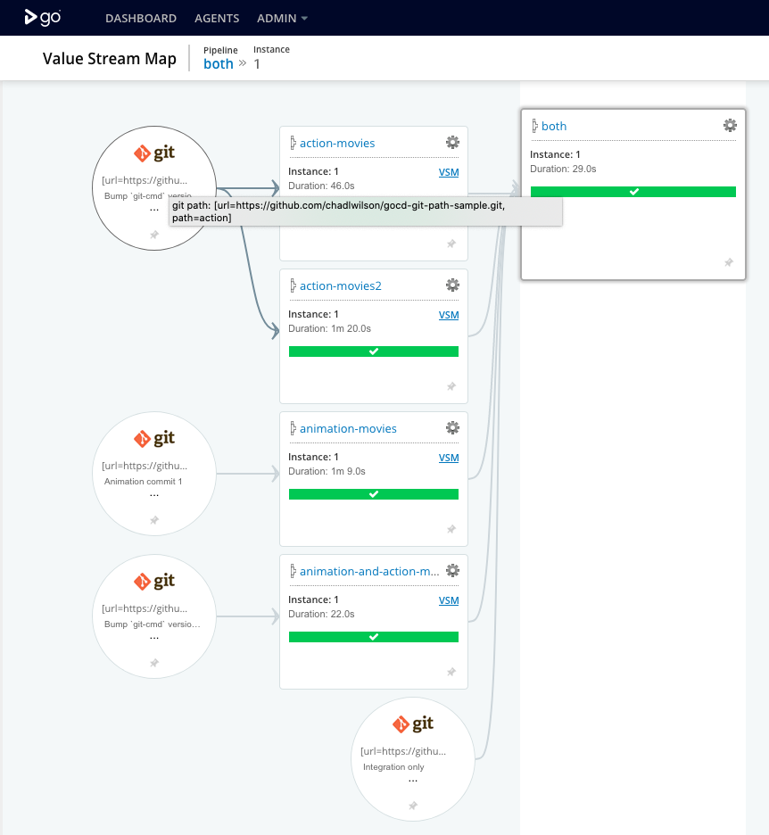
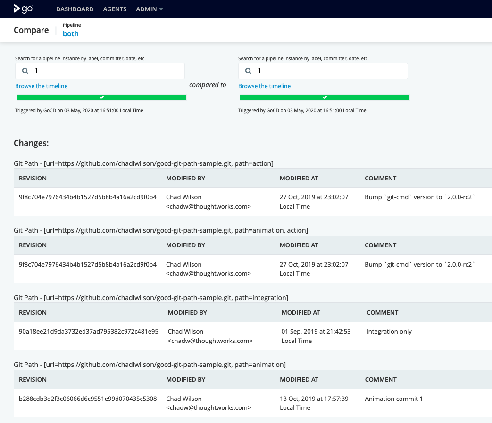

# gocd-git-path-material-plugin

[](https://github.com/TWChennai/gocd-git-path-material-plugin/actions/workflows/gradle.yml)  

GoCD plugin to introduce a material that watches on a sub-directory of a Git repository.
 
This is the missing GoCD support for [mono-repos](https://developer.atlassian.com/blog/2015/10/monorepos-in-git/).


## What you can do with this plugin
...that you can't do with the built-in Git material:
* Support **mono-repos** without excessive triggering from a material that watches the entire repository
* Implement **side-channels** into deployment pipelines for source-controlled environment configuration
* Version control deployment configuration in the same repository as your code without rebuilding software every time
  unrelated configuration is changed; supporting [twelve-factor](https://12factor.net/) apps
* **Fix fan-in** - materials that monitor different paths in a repo are considered separate when [evaluating fan-in](https://docs.gocd.org/current/advanced_usage/fan_in.html) conditions
* Provide **clean, filtered change logs** for pipeline/VSM comparisons showing only changes on the monitored paths within a repository

This plugin is intended as 
* a **drop-in replacement** for the built-in GoCD Git material (see [known issues](#known-issues) for some caveats)
* replaces the problematic use of **whitelists** and **blacklists**
  * whitelists and blacklists in GoCD tend to prevent/block fan-in because materials with different whitelists are still considered equivalent
  by the fan-in algorithm. This makes them unsuitable for use as environment side-channels or dealing with mono-repos.

### Advanced features

*Wildcard whitelists* - When the git command line is available on your agents; you can also use wildcards like `config/*/prod.yaml`. Anything that works with `git log` will work here.
*Shallow clones* - supported in the same way as the GoCD Git Material supports them

## TOC

<!-- toc -->

- [Installation](#installation)
- [Requirements](#requirements)
- [Usage](#usage)
  * [Via pipelines-as-code](#via-pipelines-as-code)
  * [Via UI wizards](#via-ui-wizards)
  * [Via UI advanced configuration](#via-ui-advanced-configuration)
  * [Visualising changes](#visualising-changes)
  * [Constructing path expressions](#constructing-path-expressions)
  * [Migration from v1 to v2](#migration-from-v1-to-v2)
  * [Frequently asked questions](#frequently-asked-questions)
- [Contributing](#contributing)
  * [Build](#build)
  * [Run](#run)
  * [Release](#release)

<!-- tocstop -->

## Installation

**Manually**
* Download from [releases](https://github.com/TWChennai/gocd-git-path-material-plugin/releases/)
* Follow the installation instructions [here](https://docs.go.cd/current/extension_points/plugin_user_guide.html#installing-and-uninstalling-of-plugins)

**Dockerized GoCD automatic plugin install**
* Find [release](https://github.com/TWChennai/gocd-git-path-material-plugin/releases/) URL
* Set environment variable like the below; replacing `${VERSION}`
    ```
    GOCD_PLUGIN_INSTALL_gocd-git-path-material-plugin=https://github.com/TWChennai/gocd-git-path-material-plugin/releases/download/v${VERSION}/gocd-git-path-material-plugin-${VERSION}.jar
    ```

## Requirements

| Plugin Version    | Requirements  | Recommended |
| ----------------- | ------------- | ----------- |
| `2.2` | GoCD >= `19.9` <br/> Server and agent running Java 11+  | GoCD `20.9` for full functionality  <br/> `git` binary available on path  |
| `2.1` | GoCD >= `18.10` <br/> Server and agent running Java 9+  | At least GoCD `19.2`, but >= `20.9` for full functionality <br/> `git` binary available on path  | 
| `1.x` | GoCD >= `15.1` <br> Server and agent running Java 7+  | |

## Usage

### Via pipelines-as-code

From GoCD `19.2.0` onwards you can use via pluggable material configuration with [gocd-yaml-config-plugin](https://github.com/tomzo/gocd-yaml-config-plugin#pluggable)
```yaml
materials:
  path-filtered-material:
    plugin_configuration:
      id: git-path
    options:
      url: https://github.com/TWChennai/gocd-git-path-sample.git
      username: username # optional
      path: path1, path2/subpath
      shallow_clone: false # optional
    secure_options: # optional
      password: 'encrypted_value'
    destination: destDir
```

### Via UI wizards

Available from GoCD `19.8.0` onwards.






### Via UI advanced configuration

Available on all compatible versions of GoCD.





You can see a sample [here](https://github.com/TWChennai/gocd-git-path-sample/blob/master/sample-pipelines.gocd.yaml).

### Visualising changes

VSM view


View changes grouped by material


### Constructing path expressions

This plugin relies on the underlying Git CLI to interpret path expressions. For that reason, you
can construct almost any expression you could do with a [git pathspec](https://git-scm.com/docs/gitglossary#Documentation/gitglossary.txt-aiddefpathspecapathspec)
including
* including certain paths
* including only certain files deep inside a path structure
* excluding certain paths or files (using `:(exclude)` or `:!` or `:^`)
* using glob syntax (using `:(glob)`)

Restrictions
* cannot contain commas (used for splitting)
* whitespace before and after splitting commas is ignored

You can normally test your expressions using something like the below to see the last revision that would have triggered a build
```shell
EXPR='path1, :(exclude)*README.md'
git log -1 $(echo "${EXPR}" | tr -d ',' )
```

For example, these are all valid expressions

```markdown
# Monitor for changes in path1 and path2/subpath
path1, path2/subpath

# Monitor for changes in path1, but ignore README changes
path1, :(exclude)*README.md

# Monitor for changes to all config files for the qa environment, in any folder
config/*/qa.yaml
```

### Migration from v1 to v2

v2 is a major overhaul of the plugin, and prefers the use of the `git` command line to the previously preferred `jgit`.
This makes the plugin consistent with more recent GoCD server & agent Docker releases, and improves ability to support
standard git features such as shallow and no-checkout clones and wildcard matches in paths.

As a result the plugin ID has changed between the two versions.

| v1 plugin id      | v2+ plugin id |
| ----------------- | ------------- |
| `GitPathMaterial` | `git-path`    |

* If you use the [gocd-yaml-config-plugin](https://github.com/tomzo/gocd-yaml-config-plugin#pluggable) to 
configure your pipelines as code; you can update the ID per the above example.
* If you configure your pipelines via the UI, you will need to add new materials and remove the old ones one-by-one.

### Frequently asked questions

#### Support for GoCD server secrets management interpolation in pipelines as code

Custom source control material plugins like the `gocd-git-path-material-plugin` only have support for GoCD [secrets management](https://docs.gocd.org/current/configuration/secrets_management.html)
and secret variable interpolation (syntax like `{{SECRET:[file-secrets][test-password]}}`) from **GoCD `20.8.0` onwards**
([changelog](https://www.gocd.org/releases/#20-8-0)).

On earlier versions if you use pipelines-as-code to source control your material definitions, you can however 
* use `secure_options` to source control an encrypted password (see [gocd-yaml-config-plugin#pluggable](https://github.com/tomzo/gocd-yaml-config-plugin#pluggable))
* use SSH keys within your GoCD server and agent to authenticate with a private repository
    * If running GoCD on Kubernetes, there is support for doing so based on Kubernetes `Secret`s within 
      the [GoCD Helm chart](https://github.com/helm/charts/tree/master/stable/gocd) or any other solution that allows 
      mounting of a file into a container.

#### Support for triggering from webhooks

Custom source control material plugins like the `gocd-git-path-material-plugin` have support for 
[triggering from webhooks](https://api.gocd.org/current/#webhook) from **GoCD `20.9.0` onwards** ([changelog](https://www.gocd.org/releases/#20-9-0)). This contrasts with the convention material polling approach (see [#27](https://github.com/TWChennai/gocd-git-path-material-plugin/issues/27) and [gocd/gocd#8170](https://github.com/gocd/gocd/issues/8170))

#### Stale data in agent repository clones

This plugin uses Git commands to filter the history and determine the most recent revision that matches the
monitored paths. This means that changes that are not monitored in your paths may be "stale". The plugin does
not `rm` un-monitored paths from a clone; meaning your build task could accidentally depend on files in the
repository that are out-of-date.

Be careful with your repository structure to keep your monitored path expressions simple, so you can easily reason about
whether a given pipeline should have been triggered for a given commit.

#### Creating new pipelines via UI on pre `19.8.0` GoCD versions

You will *not* be able to see the *Git Path* material as a material type when creating a new pipeline. 
Add a dummy git material, then edit to add a new *Git Path* material and remove the old one. This problem
has been resolved in newer GoCD versions via the pipeline creation wizard.

## Contributing

### Build

execute the following command to build the plugin

```bash
./gradlew clean build
```

### Run

You can quickly test the plugin using Docker, ensure you have installed docker, refer [docker installation guide](https://www.docker.com/products/overview) for installing docker for different environments

Execute the following gradle task to start the go-server
```bash
./gradlew clean startGoCd
```

You can now access the [go-server via port 8153](http://localhost:8153)

#### reload

If you like to reload the go-server with new build run,
```bash
./gradlew clean restartGoCd
```

#### stop

You can stop the running docker instance with the following gradle task
```bash
./gradlew clean stopGoCd
```

### Release

Released via the [gocd-plugin-gradle-task-helpers](https://github.com/gocd/gocd-plugin-gradle-task-helpers) onto
GitHub.

* Check the`gocdPlugin.pluginVersion` version in `build.gradle` and bump if necessary
    * The release helpers add a `-${COMMIT_NUM}` suffix to the version, so this is not strictly necessary for minor changes.
* Tag and publish
    ```bash
    export GITHUB_TOKEN=blah
    PRERELEASE=no ./gradlew clean build githubRelease
    ```
* Edit the release description on `GitHub` if necessary.
